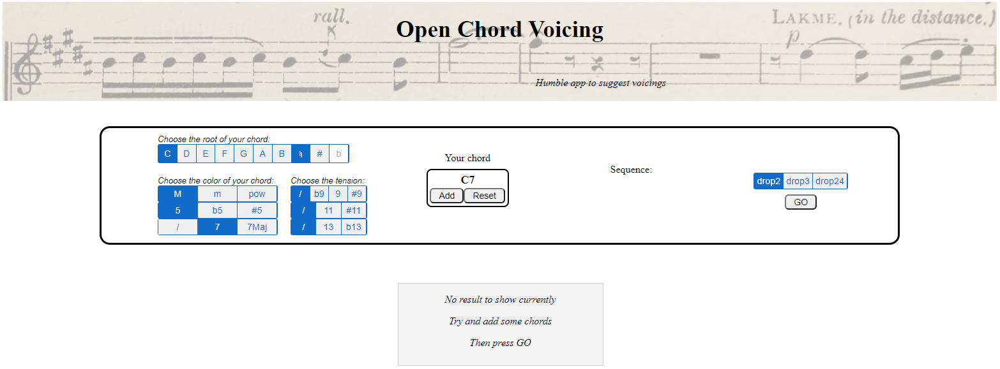
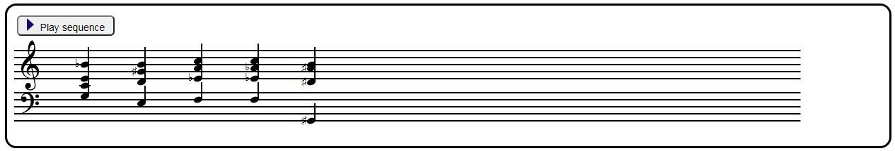
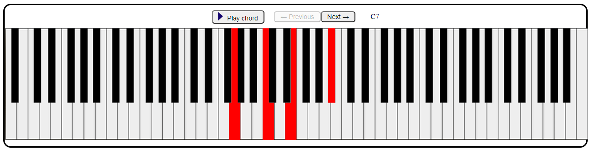
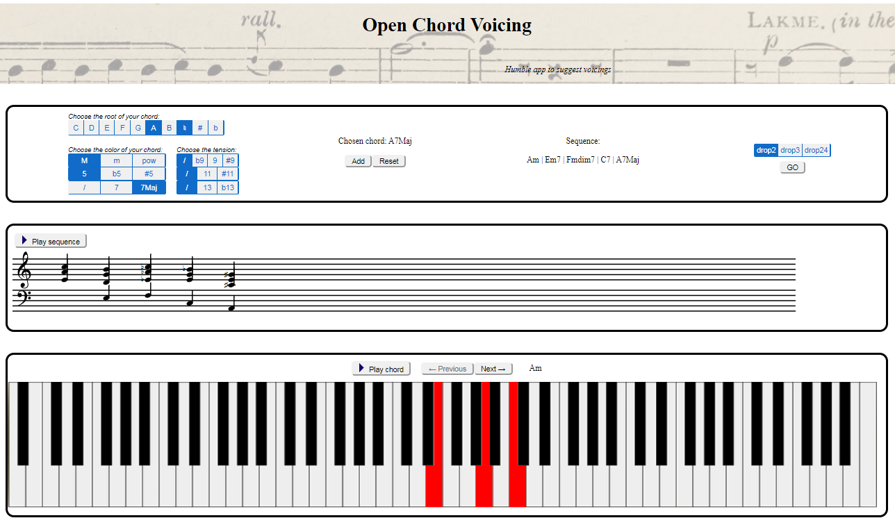

# Open Chord Voicing

#### An application for voicing suggestions

## Introduction
This application is the result of a joint project for two courses : Advanced Coding Tools & Methodologies and Computer Music Representation & Models. Our initial motivation was to help piano players to find voicings to their chords, since a musician doesn't always have access to a sheet. Sometimes, the musician has only at his disposal a sequence of the chords' names, and he might want to look for voicings ideas, or simply for a correct way to play chords he doesn't know yet. Open Chord Voicing has been designed to provide voicing suggestions for any sequence of chords, in the form of a sheet, an audio content and a mapping of the piano keys to be pressed.

> Welcome page of the application

## User interface
The user interface is a simple html page divided into 3 blocks. The first one is dedicated to the user's input, while the two others print the sheet, the piano keyboard and the audio.

### The user's input - chord selection
The first block appears on the welcoming page, and it is where the user builds his chords sequence. For each chord, the user selects a root, a color and possibly a tension among the available possibilities. Clicking on 'add' adds the chord to the current sequence. The sequence can be reset at any time with the reset button.  
When the sequence is ready, the user can select the position of the first chord among drop2, drop 3 or drop 24. The voicing of the following chords will be automatically computed by the algorithm in naive.js, where the voicing rules are implemented.

### The outputs - sheet, piano keyboard and audio
The second and the third block appear when the user clicks on 'go'. They provide the voicing suggestion in 3 different forms : a sheet music, a piano keyboard and an audio content.

#### - **The sheet**
The sheet music is managed by the module sheet.js, and is then printed in the second block.

#### - **The piano keys**
The piano keyboard is managed by the module keyboard.js, and is then printed in the third block. The keys to be pressed are colored in red, and the user can navigate through the chords by clicking on the next/previous buttons.

#### - **The audio content**
The user can listen to the audio rendering of the voicing by clicking on a play button, either for a single chord or for the whole sequence. The playing is managed by audio.js, that picks among the available mp3 files, each corresponding to one of the 88 notes of a piano. 

> Main page appears when the user clicks on "Go"

## Files

- **index.html**   
Provides the structure of the document.

- **style.css**   
Style sheet linked to the document.

- **main.js**  
Main script of the application that manages all the other modules.

- **chordrep.js**   
Module that deals with the chords representation and with music notation. Converts the user input into objects that can be more easily manipulated at the next stage.

- **naive.js**   
Module that computes the voicing suggestion with a deterministic algorithm. The first chord has the voicing selected in the first block by the user. The voicing of the following chord follows some rules implemented in naive.js, such as the optimization of the finger's displacement or the spread of notes in low and high octaves.

- **sheet.js**   
Module that builds the sheet corresponding to the computed voicing, and prints it in the 2nd block.

- **keyboard.js**  
Module that prints the keyboard and displays in red what keys should be pressed for each chord.

- **audio.js**  
Module that plays the audio associated with the sheet. For each chord, audio.js fetches the needed notes into a bank of mp3 piano notes, and play them at the same time.

- **mp3**  
Bank of piano notes in the mp3 format, from octave n°2 to octave n°5. 

## Authors
Clément Jameau  
Aliette Ravillion  
Andriana Takic  
