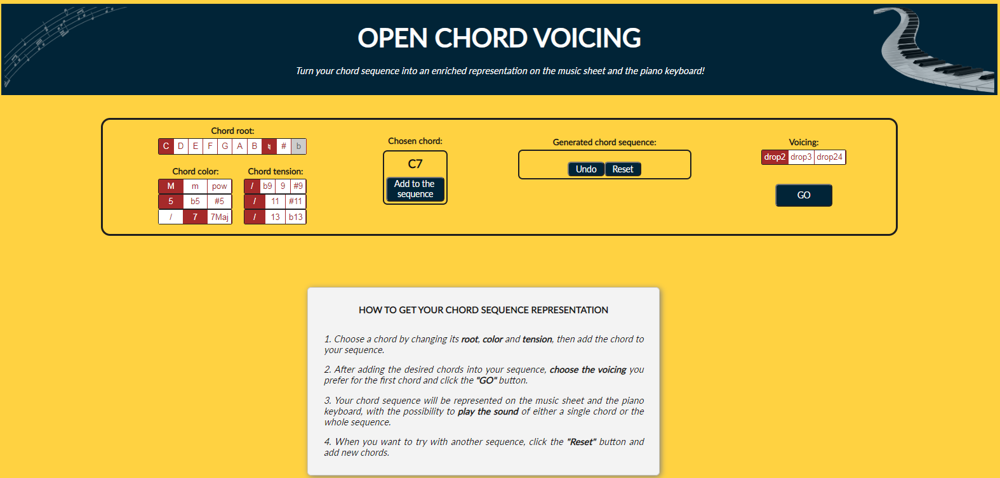

# Open Chord Voicing

#### A web application for voicing suggestions

## Introduction
This web application is developed by the group of students of Music and Acoustics Engineering at Politecnico di Milano, as the result of a joint project for two courses: Advanced Coding Tools & Methodologies and Computer Music Representation & Models. Our initial motivation was to help piano players with basic musical knowledge to find better voicings for their chord progressions, since musicians don't always have the access to a proper music sheet. Sometimes, musicians have only a sequence of the chords' names at their disposal, and they might want to look for voicings ideas, or simply for a correct way to play the chords and build transitions between them. Open Chord Voicing has been designed to provide voicing suggestions for any sequence of chords and to represent them on a music sheet, map them on the piano keys to be pressed, as well as enable the audio playback. That way, the user is able to improve their understanding of music theory and harmony, and to play any chord progression more easily and with enriched voicing.

> Welcome page of the application

## The algorithm
The input of the algorithm is the user's chord sequence, while the outputs are in the form of the music sheet, the audio playback, and the piano keyboard.

## User interface
The user interface is a simple html page divided into 3 blocks. The first block is dedicated to the user's input, while the two others print the sheet, the piano keyboard and enable the audio playback.

### The user's input - chord progression
The first block appears on the welcoming page, and it is where the user builds his chords sequence. For each chord, the user selects a root, a color and possibly a tension among the available options. By clicking the 'add' button, the user can add the chosen chord to the current chord sequence. The sequence can be reset at any time with the reset button, and the last inserted chord can be disposed with the undo button.  
When the chord sequence is ready, the user can select the position of the first chord among drop2, drop 3 or drop 24. The voicing of the following chords will be automatically computed by the algorithm in naive.js, where the voicing rules are implemented.

### The outputs - sheet, piano keyboard and audio
The second and the third blocks appear when the user clicks the 'GO' button. They provide the voicing suggestion in 3 different forms: the music sheet, the piano keyboard and the audio playback.

#### - **The music sheet**
The music sheet representation is managed by the module sheet.js, and is then printed in the second block. 

#### - **The piano keyboard**
The piano keyboard is managed by the module keyboard.js, and is then printed in the third block. The keys to be pressed are colored in red, and the user can navigate through the chords by clicking the Next/Previous buttons.

#### - **The audio content**
The user can listen to the audio rendering of the voicing by clicking the Play buttons, either for a single chord or for the whole sequence. The playback is managed by audio.js, that picks among the available mp3 files, each corresponding to one of the notes played on a piano. 

> The main page appears when the user clicks the "GO" button

## Files

- **index.html**   
Provides the structure of the document.

- **style.css**   
Style sheet linked to the document.

- **main.js**  
The main script of the application that manages all the other modules.

- **chordrep.js**   
The module that deals with the chords representation and with music notation. It converts the user input into objects that can be more easily manipulated at the next stage.

- **naive.js**   
The module that computes the voicing suggestion with a deterministic algorithm. The first chord has the voicing selected in the first block by the user. The voicing of the following chord follows some rules implemented in naive.js, such as the optimization of the fingers' displacement in transitions, the spreading of notes in low and high octaves, the range limitations within a chord and more.

- **sheet.js**   
The module that builds the sheet corresponding to the computed voicing, and prints it in the 2nd block.

- **keyboard.js**  
The module that prints the keyboard and marks in red the keys that should be pressed for each chord.

- **audio.js**  
The module that plays the audio associated with the sheet. For each chord, audio.js fetches the needed notes into a bank of mp3 piano notes, and plays them at the same time.

- **mp3**  
Bank of piano notes in the mp3 format, from covering the 2nd, 3rd, 4th and 5th octaves. 

## Authors
Clément Jameau  
Aliette Ravillion  
Andriana Takic  

[Licensed under the Non-Profit Open Software License version 3.0](https://tldrlegal.com/license/non-profit-open-software-license-3.0-(nposl-3.0))
