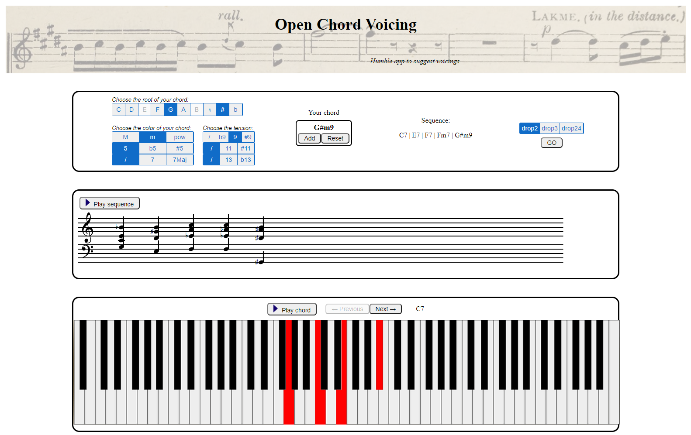

# Open Chord Voicing

#### An application for voicing suggestions

## Introduction
This application is the result of a joint project for our courses Advanced Coding Tools and Methodologies and Computer Music Representation and Models. Our initial motivation was to help piano beginners to add interesting voicings to their chords. Sometimes, a musician doesn't have access to a sheet, but only to the sequence of the chords' names. He might ghen want to look for voicings ideas, or simply for a way to play correctly chords he doesn't know yet. Open Chord Voicing has been designed to build a voicing suggestion for any sequence of chords, and to provide the sheet, the associated audio and the piano keys to be played. 

> page of the application after the user selected a chord sequence 

## User interface
The user interface is a simple html page divided into 3 parts. 

### The user's input - chord selection
The first block is where the user builds his chords sequence. For each chord, the user selects a root, a color and a tension among the available possibilities. Clicking on 'add' adds the chord to the current sequence. The sequence can be reset at any time with the reset button.
When the sequence is ready, the user can select the voicing of the first chord : drop2, drop 3 or drop 24. The voicing of the following chords will be automatically computed by the algorithm in naive.js, where the voicing rules are implemented.

### The outputs - sheet, piano keys and audio
The second and the third block appear when the user has clicked on 'go'. They provide the voicing suggestion in 3 different forms : a sheet music, a piano keyboard and some audio.

#### - **The sheet**
The sheet music is computed by the file sheet.js, and is then printed in the second block.

#### - **The piano keys**
The piano keyboard is computed by keyboard.js, and is then printed in the third block. The keys to be pressed are colored in red, and the user can scroll through the chords by clicking on the next/previous buttons.

#### - **The audio content**
The user can have an auditive preview of the voicing by clicking on a play button, either for a single chord in the 3rd block, either for the whole sequence in the 2nd block. The playing is done by audio.js, that picks among the available mp3 files, each corresponding to one of the 88 notes of a piano. 

## Files

- **index.html** 
Provides the structure of the user interface.

- **style.css** 
Describe the style parameters of the html elements.

- **main.js** 
Contains the main algorithm of the application, calling every other javascript files.

- **chordrep.js** 
Deals with the chords representation and with music notation. Converts the user input into objects that can be more easily manipulated at the later stage.

- **naive.js** 
Compute the voicing suggestion. The first chord has the voicing selected in the first block by the user. The voicing of the following chord follows some rules implemented in naive.js, such as the optimization of the finger's displacement or the spread of notes in low and high octaves.

- **sheet.js** 
Builds the sheet corresponding to the computed voicing, and prints it in the 2nd block.

- **keyboard.js** 
Prints the keyboard and displays in red what keys should be pressed for each chord.

- **audio.js**  
Plays an audio associated to the sheet. For each chord, audio.js fetches the needed notes into a bank of mp3 piano notes, and play them at the same time.

- **mp3**  
Bank of piano notes in the mp3 format, from octave n°2 to octave n°5. 

## Authors
Clément Jameau
Aliette Ravillion
Andriana Takic
